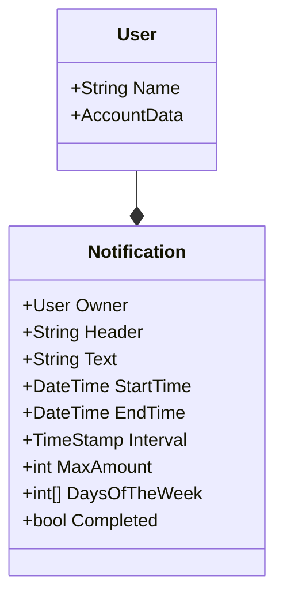

# Notificator

Notifications service.

# Domain logic

## Notification

* `Owner`. Each notification is owned by a user
* `Header`. Header of a notification
* `Text`. Text of a notification
* `StartTime`. First time notification should be sent
* `EndTime`. Time after which notification should not be sent
* `Interval`. How often notification should be sent
* `MaxAmount`. Another way to restrict notification sending. Sets maximum amount of times that notification can be sent
* `DaysOfTheWeek`. Sets days of the week in which notification can be sent
* `Completed`. Defines wheter a notification whether a notification is completed
